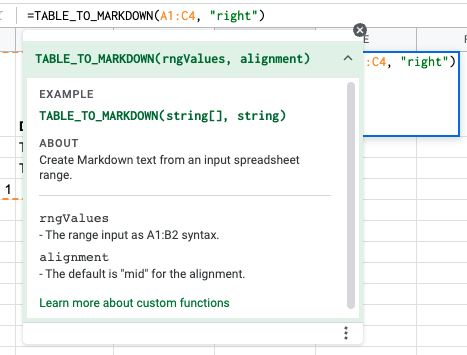

# Markdown table generation using a user-defined function

I really like Markdown but writing Markdown tables by hand is not fun. I have used a Google Sheets
user-defined function for a while to turn a spreadsheet input range into a Markdown table for me.
If you are unfamiliar with Markdown tables and how they are syntactically defined, check out
[Extended Syntax - Advanced features that build on the basic Markdown syntax.](https://www.markdownguide.org/extended-syntax)

I have used that site's example table and pulled it into Google Sheets using the handy 
__IMPORTHTML__ function. Here's the call I entered in cell A1 to get the table:

`=IMPORTHTML("https://www.markdownguide.org/extended-syntax","table",2)`

As a learning exercise, I re-wrote the function for Excel using VBA.

## Outputs

### Centred

#### Function call

Default is "mid" so second argument is omitted here.

`=TABLE_TO_MARKDOWN(A1:C3)`

Google Sheets helpfully displays information for the custom function when you type in its name
just as it does for built-in spreadsheet functions as shown here.

#### Raw markdown generated

<pre>
|Syntax|Description|Test Text|
|:---:|:---:|:---:|
|Header|Title|Here’s this|
|Paragraph|Text|And more|
</pre>

#### Rendered output

|Syntax|Description|Test Text|
|:---:|:---:|:---:|
|Header|Title|Here’s this|
|Paragraph|Text|And more|

### Left-aligned

#### Function call

`=TABLE_TO_MARKDOWN(A1:C3, "left")`

#### Raw markdown generated 

<pre>
|Syntax|Description|Test Text|
|:---|:---|:---|
|Header|Title|Here’s this|
|Paragraph|Text|And more|
</pre>

#### Rendered output

|Syntax|Description|Test Text|
|:---|:---|:---|
|Header|Title|Here’s this|
|Paragraph|Text|And more|

### Right-aligned

#### Function call

`=TABLE_TO_MARKDOWN(A1:C3, "right")`

#### Raw markdown generated

<pre>
|Syntax|Description|Test Text|
|---:|---:|---:|
|Header|Title|Here’s this|
|Paragraph|Text|And more|
</pre>

#### Rendered output

|Syntax|Description|Test Text|
|---:|---:|---:|
|Header|Title|Here’s this|
|Paragraph|Text|And more|

## Source code

- [The VBA version](https://github.com/Rotifer/VBA_GAS/blob/main/Markdown_Generation/modMarkdownGenerator.bas)
- [The GAS version](https://github.com/Rotifer/VBA_GAS/blob/main/Markdown_Generation/sheets_table_to_markdown.js)

## GAS versus VBA

I have written an a Google Sheets GAS and an Excel VBA version of a custom function
(aka user-defined function or UDF) to generate a Markdown table from sheet input. The 
The source code for each is given in the links below:

- <a href="https://github.com/Rotifer/VBA_GAS/blob/main/Markdown_Generation/modMarkdownGenerator.bas">The VBA version</a>
- <a href="https://github.com/Rotifer/VBA_GAS/blob/main/Markdown_Generation/sheets_table_to_markdown.js" target="_blank">The GAS version</a>

To follow along, open the links above in separate tabs side-by-side with this one.
